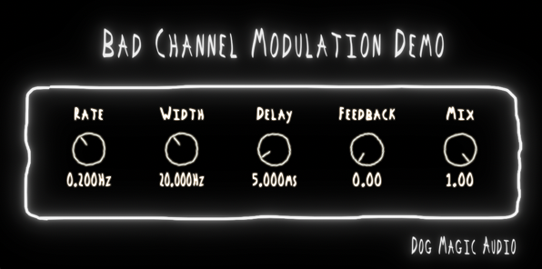

# ~ BAD CHANNEL MODULATION DEMO ~
 
## A warped, wide, and wobbly modulation plugin for audio production.

Bad Channel Modulation Demo is an open-source multi-voice stereo modulation module from a larger project, Bad Channel. This modulation section is a super wide three voice Chorus/Flanger, which detunes three delay lines within panorama and adds them back to the original signal. Features parameter smoothing, parameter automation, and state saving and loading.

Written in C++ using the JUCE API. Available for all platforms in VST3, AU, and AAX formats.

**-------------------------------------------------------------------------------------------**

### CONTROLS:
**RATE:**
LFO frequency in hertz.

**WIDTH:**
Modulation amount in ms.

**DELAY:**
Time in ms between original and modulated signals.

**FEEDBACK:**
Produces cascading and decaying echoes.

**DEPTH:**
Intensity of modulation effect.

**-------------------------------------------------------------------------------------------**

### DOG MAGIC AUDIO 2021 - SOFTWARE FOR TONAL ANNIHILATION ###
